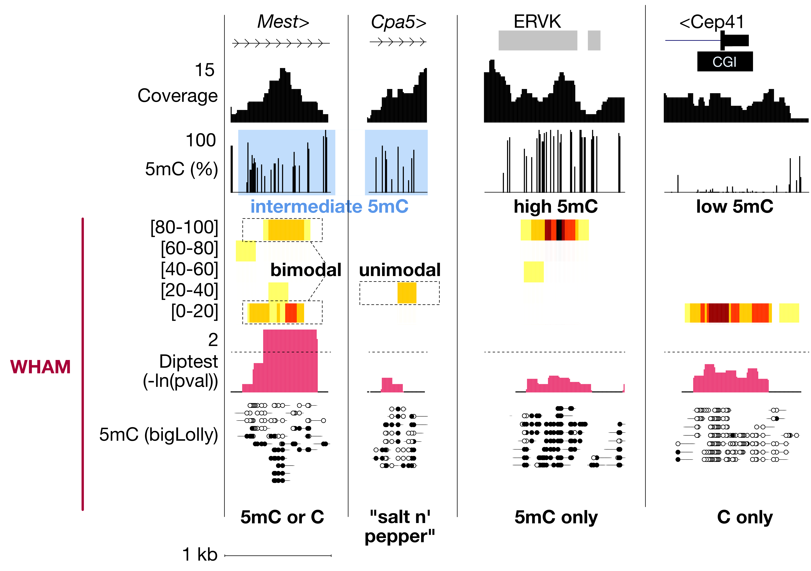

# WHAM

**W**GBS **H**eterogeneity **A**nalysis at the **M**olecular level

A toolkit for analysing the distribution of DNA methylation across individual
reads from Bismark-aligned WGBS data. It produces UCSC genome-browser tracks for
three analyses:

1. **Lollipop** visualization of per-read methylation calls
2. **Heatmap** of read-level methylation distribution
3. **Diptest** modality test for non-unimodal (heterogeneous) methylation

## Installation

Install all dependencies into an isolated environment using conda:

```bash
git clone <this-repo-url> WHAM
cd WHAM
conda env create -f environment.yml
conda activate wham
```

**Apple Silicon (osx-arm64):** some UCSC tools (`ucsc-*`) are only built for osx-64 on bioconda. If conda cannot find them, create the env under the osx-64 subdir (runs via Rosetta 2) using this trick:
```bash
CONDA_SUBDIR=osx-64 conda env create -f environment.yml
```

### Dependencies

Installed automatically by `environment.yml`:

- `samtools`, `bedtools`, `gawk`
- UCSC `bedToBigBed`, `bedGraphToBigWig`
- `R` with `diptest`, `foreach`, `doParallel`
- Optional (only for `-p` traditional tracks): `bismark`, `deeptools` (`bamCoverage`)

Verify everything is installed correctly:

```bash
./WHAM.sh -d
```

## Usage

```bash
./WHAM.sh -i <bismark.bam> -z <genome.sizes> -o <output_dir>
```

The input must be a **Bismark-aligned** BAM (reads carry `XM:Z:` methylation and
`XG:Z:` genome-strand tags). Both single-end and paired-end data are supported;
paired mates are automatically combined. Output is written to
`<output_dir>/Track_Hub/`, ready to load at in the UCSC Genome Browser (Track Hubs).

### Example

```bash
./WHAM.sh -i Rat_BNxWKY_Epiblast_rep1.bam -z rn7.sizes -o results
```

### Options

| Flag | Description | Default |
|------|-------------|---------|
| `-i` | Input Bismark `.bam` file (**required**) | |
| `-z` | Chromosome sizes file | mm10 |
| `-o` | Output directory for `Track_Hub` | current directory |
| `-s` | Scratch directory | a temp folder created beside the input BAM |
| `-t` | Number of threads | SLURM allocation, else all cores |
| `-q` | Minimum mapping quality | 40 |
| `-C` | Minimum CpGs per read | 4 |
| `-G` | Genome bin size for Diptest | 100 |
| `-H` | Genome bin size for Heatmap | 25 |
| `-B` | Number of methylation bins for Heatmap | 5 |
| `-R` | Max reads for color scaling in Heatmap | 10 |
| `-c` | Number of color bins for Heatmap | 5 |
| `-p` | Also create traditional methylation/coverage tracks | off |
| `-l` | Skip lollipop track | on |
| `-m` | Skip heatmap track | on |
| `-D` | Skip diptest track | on |
| `-b` | Reference BED file (runs ONLY diptest over these regions) | |
| `-d` | Check dependencies and exit | |
| `-h` | Full help | |

## Output File types and descriptions
### Read-level 5mC tracks
```bash
chr19   2442    2443    start   1       .       0       0       210,230,255     2 # light blue start of read
chr19   2444    2445    Z       1       .       0       0       0,0,0           2 # black methylated C
chr19   2447    2448    bp      1       .       0       0       150,150,150     0 # grey spacer
chr19   2463    2464    z       1       .       0       0       255,255,255     2 # white unmethylated C
chr19   2594    2595    end     1       .       0       0       210,230,255     2 # light blue end of read
...
```
### Diptest tracks
```bash
chr19   11200   11400   -9.99995e-06 # not significant (<1.3)
chr19   14000   14300   -9.99995e-06
chr19   17300   17700   -9.99995e-06
...
chr19   49237000        49237100        4.20459 # significant (>1.3)
chr19   39521900        39522000        4.25425
chr19   45640900        45641000        4.41647
...
```
### Heatmap tracks
```bash
# One track per methylation-level bin x read-depth bin
bin0-0.bw     bin100-2.bw   bin100-8.bw   bin20-2.bw    bin20-8.bw    bin40-4.bw    bin60-2.bw    bin80-2.bw    bin80-8.bw
bin100-0.bw   bin100-4.bw   bin20-0.bw    bin20-4.bw    bin40-0.bw    bin40-6.bw    bin60-4.bw    bin80-4.bw
bin100-10.bw  bin100-6.bw   bin20-10.bw   bin20-6.bw    bin40-2.bw    bin60-0.bw    bin80-0.bw    bin80-6.bw

bigWigToBedGraph bin20-8.bw tmp && head -n 2 tmp
chr19   13762550        13762675        20
chr19   19353325        19353450        20
...
```
### Coverage tracks
```bash
# Typical depth coverage track
chr19   19900   20350   0
chr19   20350   20400   1
chr19   20400   20450   4
chr19   20450   20500   7
...
```
### Average methylation tracks
```bash
# Typical mean methylation tracks output from bismark methylation extractor
chr19   38680   38681   50
chr19   38814   38815   0
chr19   39364   39365   33.3333
chr19   39920   39921   100
...
```

## Screenshots


**Left**: Mest shows intermediate 5mC levels, but a bimodal distribution of read-level 5mC levels and clear fully methylated and fully unmethylated reads. This is a known imprinted locus, reflecting stable parental allele-specific 5mC. 

**Middle-left**: The nearby gene Cpa5 has an intermediately methylated gene body. The distribution of read-level 5mC is unimodal, reflected a "salt and pepper" distribution of 5mC throughout each read. 

**Middle-right**: A nearby fully methylated ERVK endogenous retrotransposon.

**Right**: A nearby fully unmethylated CpG island promoter. 

### Reference
bioRxiv here